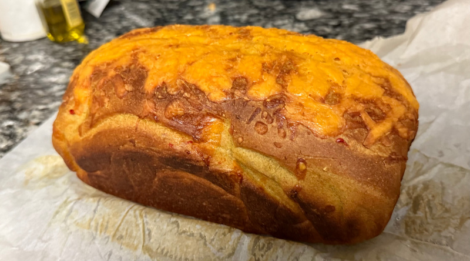
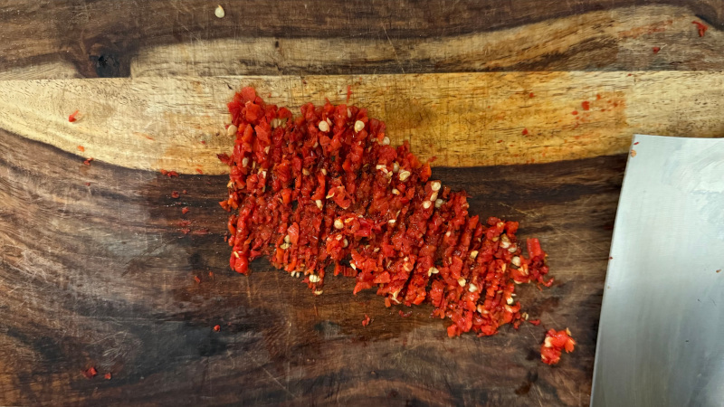
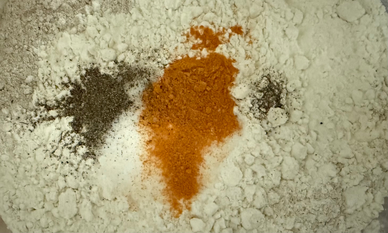
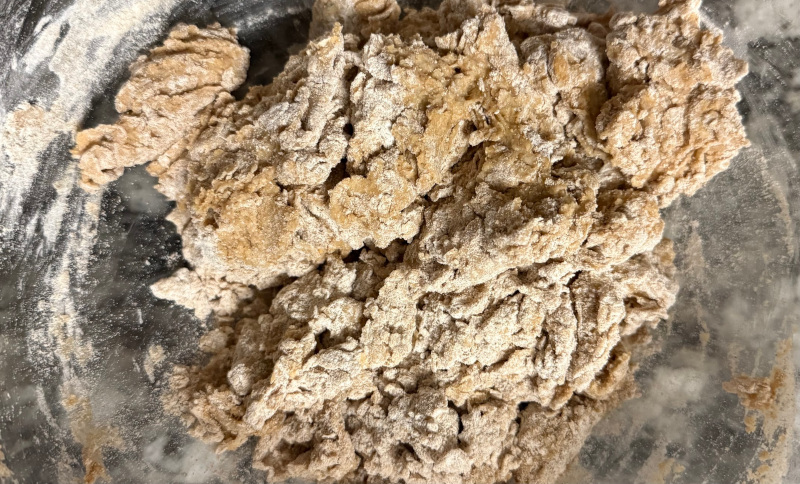
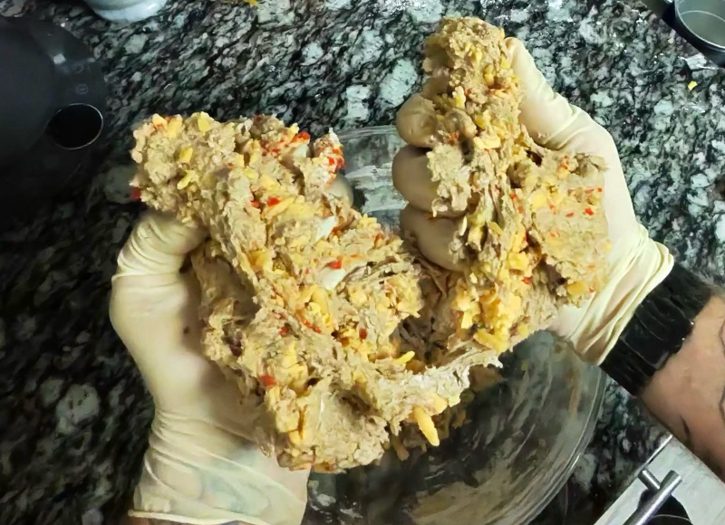
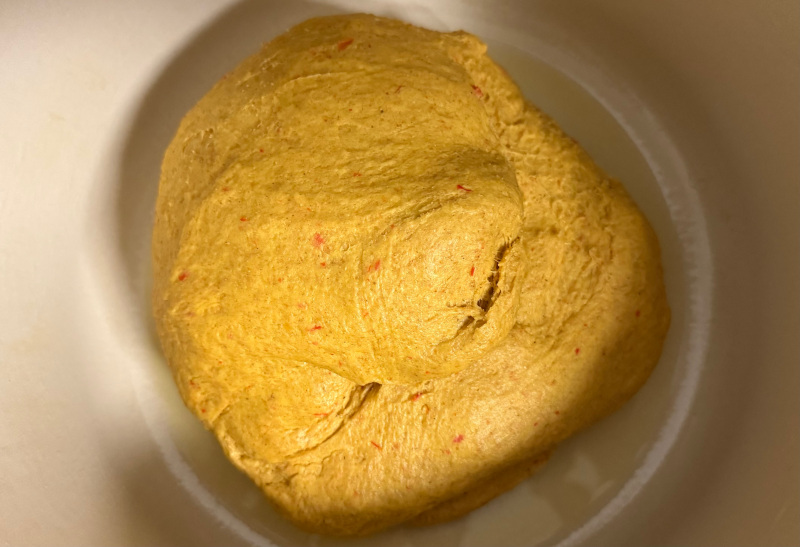
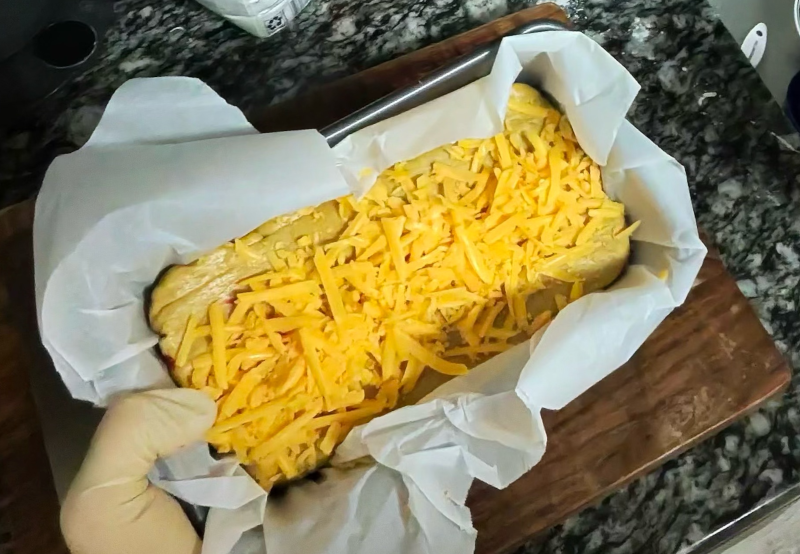
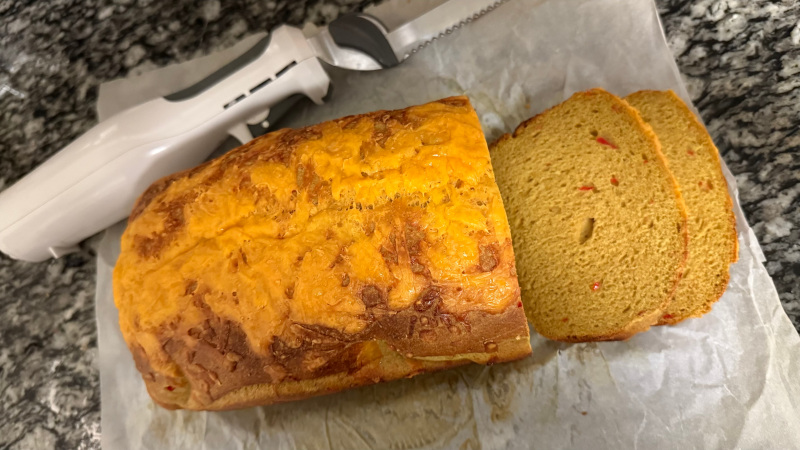

# Danger Bread

The goal is to create a bread that balances spicy, chewy, and savory elements, with ingredients chosen specifically for their anti-inflammatory properties as well as their impact on flavor and texture. 

I opted to use habanero because it has a sweeter, fruitier flavor profile than jalapeno. I'm hoping to bring those bright flavors to the foreground while maintaining some of the heat. Additionally, capcasin has anti-inflammatory properties, and habanero has 50x more capcasin than jalapeno.

We're using wheat flour because it is more nutritious and has a lower glycemic impact than other flours, while also contributing to the bread's taste. By combining 2 cups of wheat with 1 cup of white flour, I aim for a balance of nutrition and a fluffy texture.

The addition of turmeric provides a gorgeous, earthy aroma and a nice, festive orange color, while also offering anti-inflammatory properties. Curcumin (the active compound in turmeric) blocks cytokines and neutralizes free radicals that cause inflammation. Curcumin doesn't absorb well on its own, but the addition of the black pepper (or specifically, the compound piperine, which it contains) is supposed to increase absorption by 2,000% (According to studies published by the [NIH](https://pubmed.ncbi.nlm.nih.gov/38107126/)). Curcumin is also fat-soluble, so the cheese and oil should, theoretically, absorb it and make it more bioavailable as well.

I decided to add some honey to round out the spice of the peppers. Yeast also loves honey, or so I've read, so perhaps we'll get a boost if we add it to the water we use to activate the yeast. Honey also provides polyphenols, which are antioxidants. Seems like a solid addition to me.

## 1st Loaf
The cheese and white flour made this bread extremely chewy. The texture and the aroma are perfect. However, I was expecting more flavor, particularly from the peppers. The spice was more of an after-effect that wasn't even really noticeable until several minutes after I had eaten it. I was also hoping for more of those fruity undertones of the habanero. Before I try adding garlic or ginger, I'd like to try roasting the peppers before adding it to the dough.

## 2nd Loaf
Roasting the peppers further reduced the already lacking heat and did not noticeably increase the fruity notes of the peppers. For the third attempt, I would like to double the amount of peppers, skip the roasting, and add 1/4 or 1/2 tsp of freshly ground ginger. Ginger would further increase the anti-inflammatory properties of the bread while hopefully highlighting the pepper's deep fruity notes.

## 3rd Loaf
There was no value added by roasting the peppers, so I left the peppers fresh for the third round. I did add 1/4 teaspoon of finely grated fresh ginger, though, and I doubled the habanero from 2 to 4. The spice level is just right now. Not "call the fire department" hot, but still some pleasant warmth that kicks in just after you take a bite. This is nearly perfect, but I think I could squeeze out some more of the fruity notes from the peppers by doubling the ginger content. I will leave that experiment for another day, though.

## Recipe
The final recipe, with all adjustments made.

### Ingredients

 - 2 cups whole wheat flour
 - 1 cup bread flour
 - 1/4 tsp finely grated fresh ginger
 - 8 oz brick of very sharp cheddar (I used Cabot "Seriously Sharp" Cheddar)
 - 2 fresh red habanero peppers
 - 2 tsp salt
 - 2 tbsp honey
 - 2 tbsp olive oil
 - 1/2 tsp tumeric powder
 - 1/8 tsp black pepper
 - 1 packet (2 1/4 tsp) active dry yeast
 - 1 cup warm water

### Directions

##### Prep the Flavors

Shred the cheese, grate the ginger, and mince the peppers. Don't use pre-shredded cheese because they add an anti-caking powder to it. Mince the peppers, discarding only the stems. Leave the seeds in. You're gonna want to wear gloves.

##### Activate Yeast
In a bowl or measuring cup, stir together 1 cup of warm water (just from the hot side of the faucet) and your 2 tbsp of honey, along with your packet of yeast. Let the honey come to room temperature before adding it otherwise, it may cool the water too quickly. It's also easier to measure when warm or at room temperature.

##### Mix Dry Ingredients

In a large bowl, mix the 1 cup of bread flour, 2 cups of wheat flour, 2 tsp salt, 1/2 tsp tumeric powder, and 1/8 tsp of black pepper. Black pepper boosts curcumin absorption from the turmeric.

##### Mix the Wets and the Dries

First, stir your 2 tbsp olive oil into the yeast and water mixture, then mix the wets in with the dries until it just starts to come together. Don't over-mix at this stage. The dough should look shaggy.

##### Bring it to Flavor Town

Fold in the cheese and the minced pepper by hand. Wear your gloves. Save about 3 pinches of the cheese to be used as topping.

##### Knead the dough

Knead the dough on a lightly floured surface. Wear your gloves. Do this for about 10 minutes until the cheese homogenizes with the dough and the dough is bouncy and springy.

##### Let it Rise
Put the bread in a lightly oiled container. I used my Dutch oven. Cover it and let it sit for an hour. It should get a little bigger.

##### Second Rise

Line the bread pan with parchment paper, since we're using sticky cheese. Put the bread in the pan and push it down flat. Top it with cheese. Let it sit there for another 30 minutes, and then pre-heat the oven to 375.

##### Bake it
After the oven is hot, throw the loaf in and set a timer for 35 minutes.

##### Let it Cool
Let it cool for 30 minutes before cutting it.

